# TumblrX


## 📝 Table of Contents

- [About](#about)
- [features](#features)
- [Technologies used](#build)
- [getting started](#start)
- [Demo](#demo)
- [screenshots](#screenshots)

### 🚩About<a name = "about"></a>

**TumblrX** is a full mimic for Tumblr with all its functionalities

It is a full-stack application that allows you to create a blog, post, and comment on your blog.

it is a social media app to:

- express yourself, discover yourself, and bond over the stuff you love.💖
- It's where your interests connect you with your people🤝.
- The service allows users to post multimedia and other content to a short-form blog. Users can follow other users' blogs.

### ✨ Features <a name = "features"></a>

- create a blog and post to it.
- **add posts** (including photos, videos, and text)
- **react** to posts && comments
- **add comments**
- **reblog posts**
- **follow** other users' blogs to see their posts
- show **dashboard** with all your posts and comments
- **explore section** to show all trending posts and blogs
- **search section** to search for posts and blogs
- blog section where you can show your blog & customize it
- **real time chat** with other users
- **real time notifications** show you all updates on your blog
- manage your blog && account settings and edit them

## 💻Technologies Used<a name = "build"></a>

- React
- React-Router dom
- Redux Toolkit
- sass modules
- Axios
- Socket io
- pusher-js
- Docker
- Jest
- Webpack

## 🏁Getting Started <a name = "start"></a>

1. **_Clone the repository_**

```bash
 git clone https://github.com/TumblrX/Frontend.git
```

2. **_Go to the directory of the repository_**

```bash
 $ cd Frontend
```

3. **_install Dependencies_**

```bash
npm install
```

4. **_Run the Website and Enjoy your time 🔥_**

```bash
npm run
```

## 🎥 Demo<a name = "demo"></a>

<div name = "demo" align="center" width=1189>

</div>

## 🎥 screenshots<a name = "screenshots"></a>

- Home Page
  

  <hr />

- Sign Up
  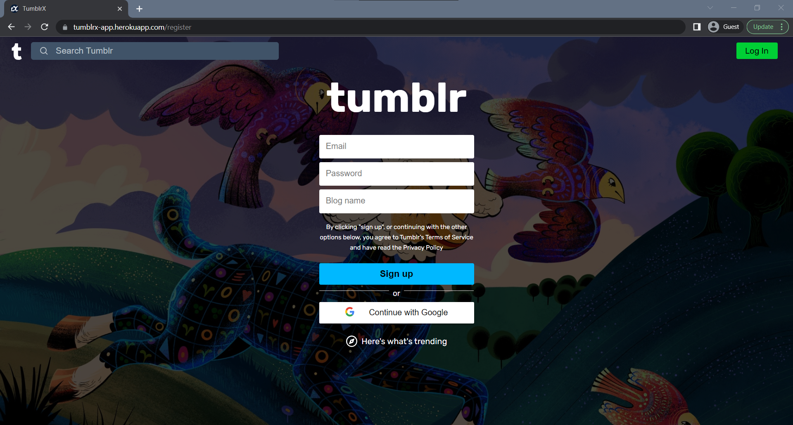

  <hr />

- Dashboard
  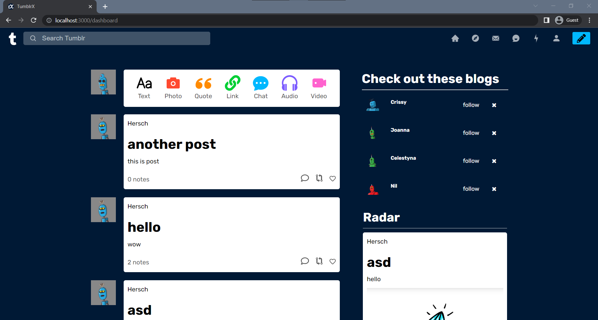

    <hr />

- Explore Section
  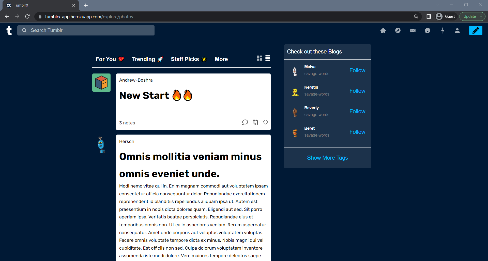

    <hr />

- Add Post
  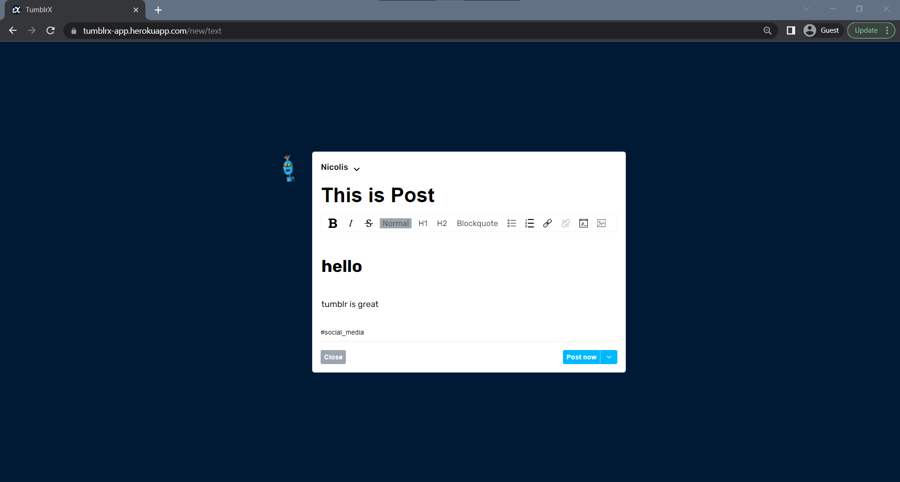

    <hr />

- Comments
  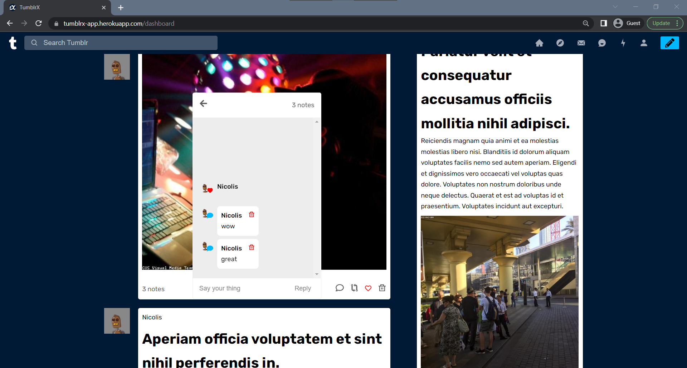

    <hr />

- Blog View
  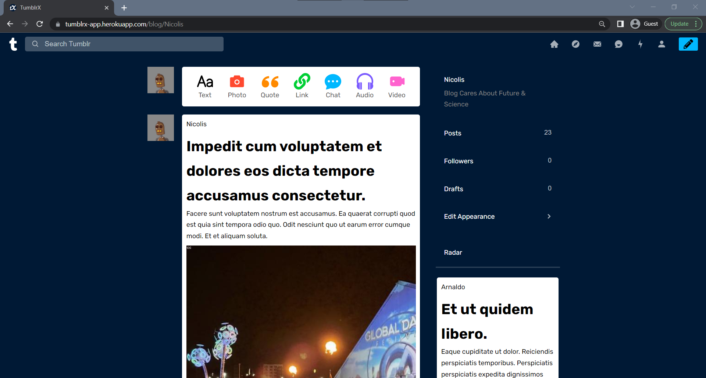

    <hr />

- Edit Blog View
  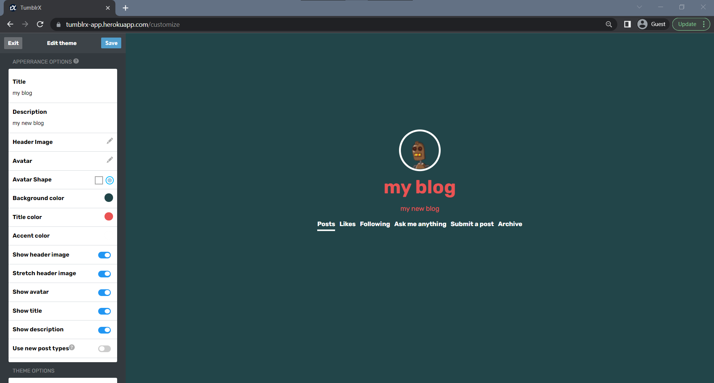

    <hr />

- Settings
  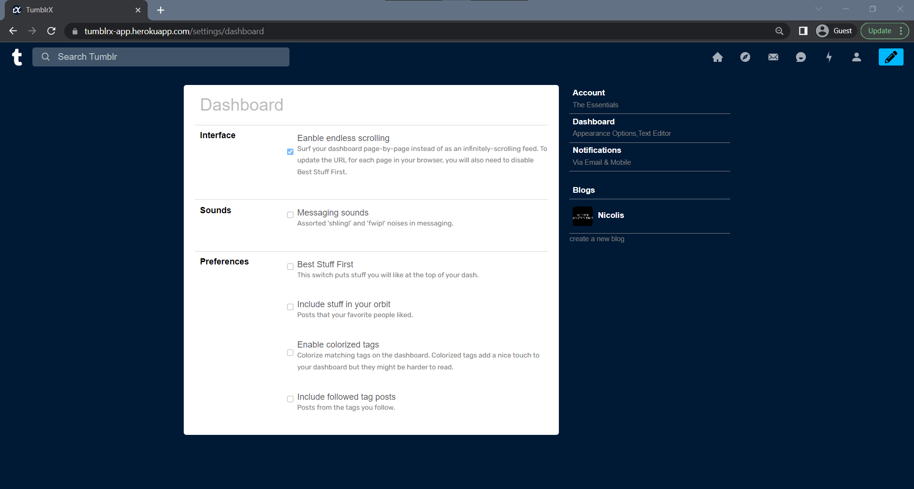

  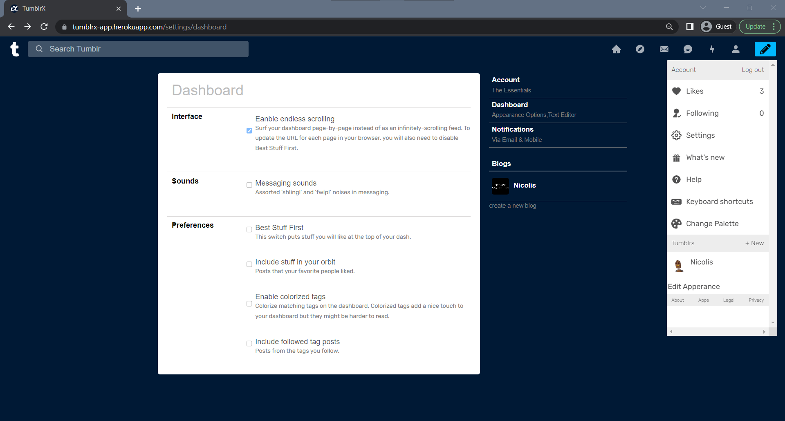
  <hr />

- Responsive

  - Sign up
    

      <hr />

  - DashBoard
    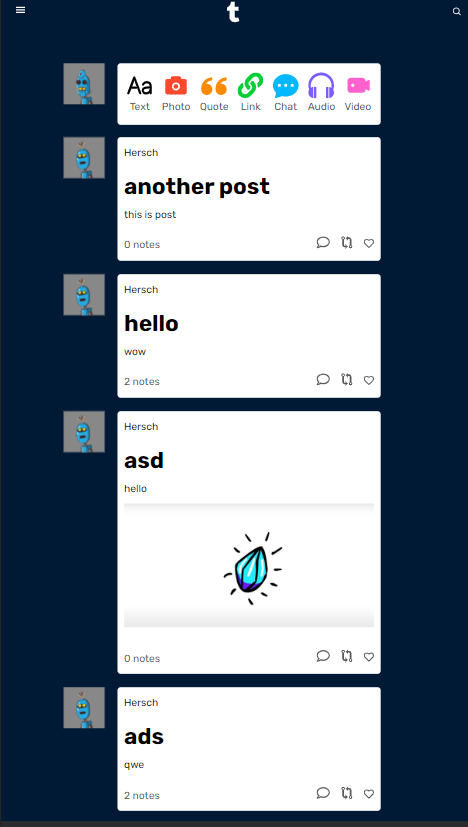

      <hr />

    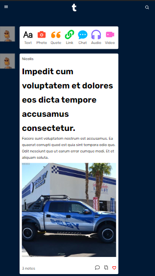

      <hr />

    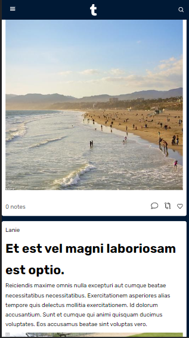

      <hr />

  - Edit Appearance
    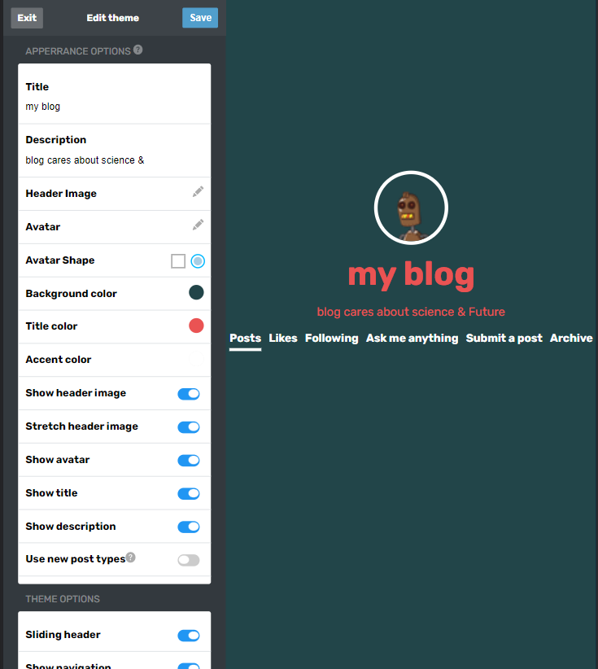

      <hr />

  - Blog
    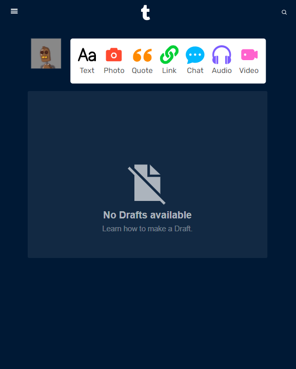

      <hr />

  - search
    

      <hr />

## ✨ contributers<a name = "contributers"></a>

## contributors

<div align="center" width=1189> 

[](https://github.com/omar214)
[](https://github.com/Taher-Mohamed-Ahmed-Saad)
[](https://github.com/YousefElshabrawy)
[](https://github.com/Thebrownboy)
[](https://github.com/Ahmedmma72)
[](https://github.com/AhmedNossir)

</div>


## file structure<a name = "file structure"></a>
